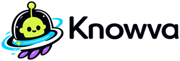
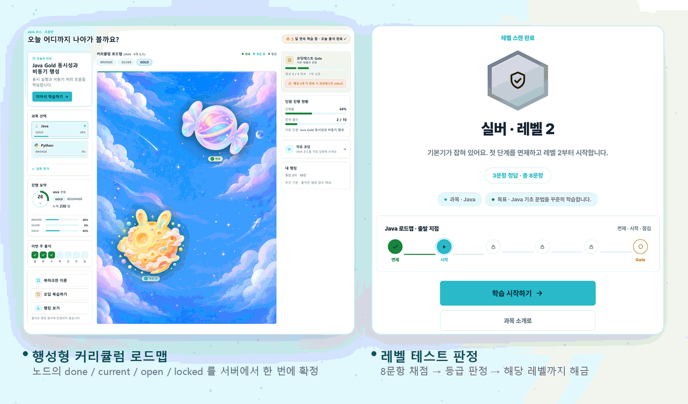
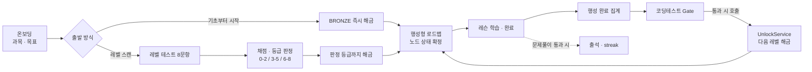
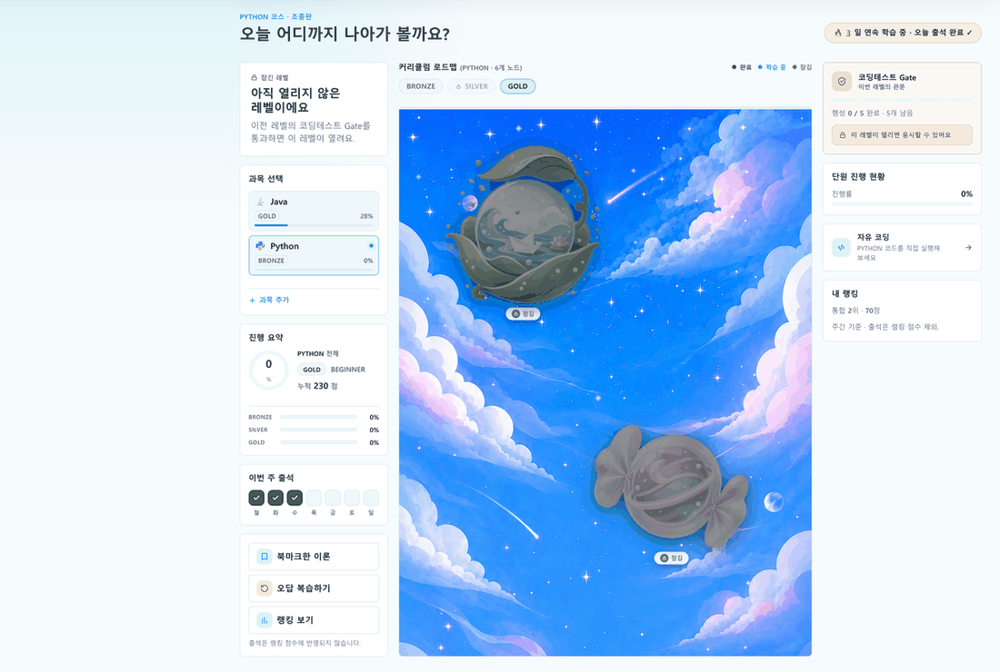
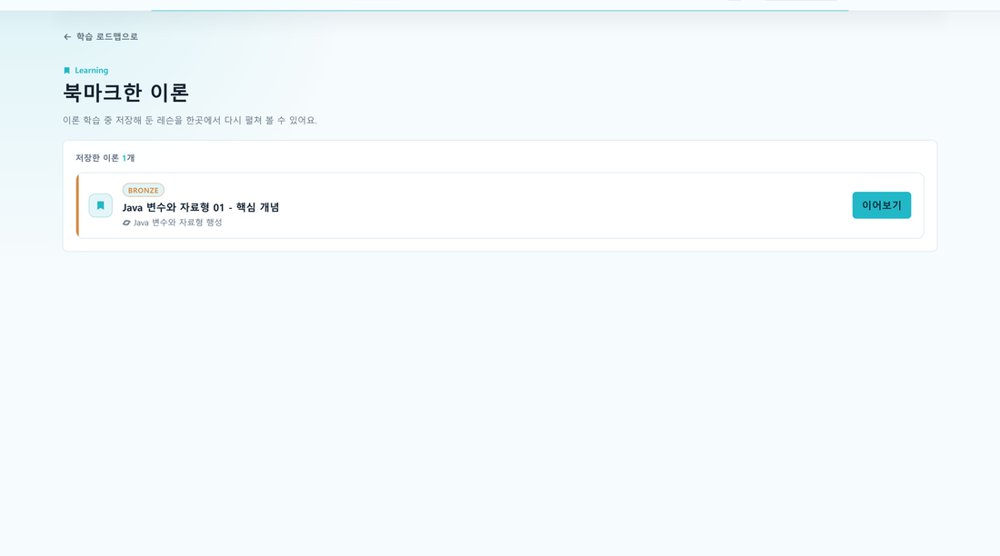
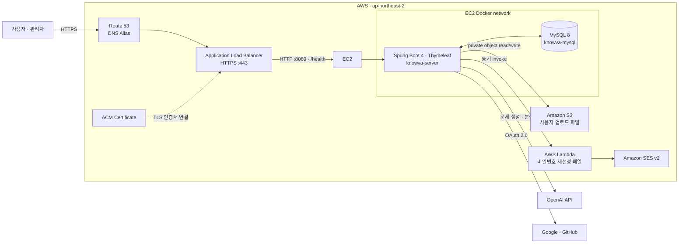
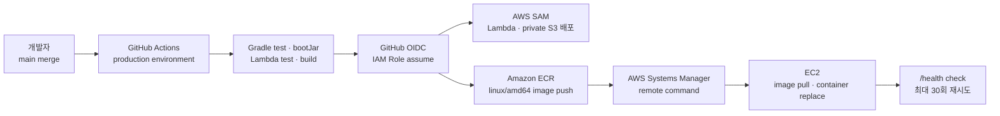

<p align="center">
  <picture>
    <source media="(prefers-color-scheme: dark)" srcset="docs/portfolio/images/logo_dark.png" />
    
  </picture>
</p>

<h1 align="center">learning 도메인</h1>

<p align="center">
  <strong>단계 잠금 · 출석/스트릭 · 레벨 테스트 · 북마크 — 학습 진행 규칙을 서비스와 DB 계층에서 다룬 도메인</strong>
</p>

<p align="center">
  
  
  
  
  
</p>

<p align="center">
  
  
  
  
  
  
  
  
</p>

<p align="center">
  <a href="#-담당-범위">담당 범위</a> ·
  <a href="#-핵심-구현">핵심 구현</a> ·
  <a href="#-트러블슈팅">트러블슈팅</a> ·
  <a href="#-실행-방법">실행 방법</a> ·
  <a href="#-팀-프로젝트-knowva">팀 프로젝트 전체</a>
</p>

<p align="center">
  <picture>
    <source media="(prefers-color-scheme: dark)" srcset="docs/portfolio/images/01_hero_dark.png" />
    
  </picture>
</p>

> **7명이 함께 만든 팀 프로젝트입니다.** 이 README의 위쪽 절반은 제가 맡은 `learning` 도메인만 다루고,
> 팀 전체 소개는 [아래쪽](#-팀-프로젝트-knowva)에 그대로 두었습니다.
> 원본 저장소를 포트폴리오용으로 fork한 것이며, 코드에는 팀원 7명의 작업이 함께 들어 있습니다.
>
> 에이콘 KDT 최종 프로젝트 · 2026.06–07 · 외부 심사가 포함된 평가에서 **팀 1위(최우수상)** — 팀 성과입니다.

---

## 🟢 담당 범위

로그인 직후 첫 화면부터 **과목 선택 → 커리큘럼(로드맵) → 이론 학습 → 레벨 테스트 → 진행률·출석**까지가 제 담당입니다.
다른 팀원(문제풀이·AI 시험·랭킹)이 제가 쓴 진행도·레벨·출석 데이터를 가져다 씁니다.

| 영역 | 만든 것 |
| --- | --- |
| 온보딩 | 과목·목표·출발 방식 선택. 출발 방식이 이후 모든 화면의 잠금 상태를 결정 |
| 커리큘럼 로드맵 | 행성(Planet)·레슨·게이트 노드의 `done / current / open / locked` 판정 |
| 이론 레슨 | 레슨 상세, 완료 처리, 북마크 토글 |
| 레벨 테스트 | 8문항 제출·채점·등급 판정·해금 반영 (**AI 미사용**, 사전 등록 문제) |
| 진행률 | 레슨 단위 집계 → 행성 완료 수·진행률·다음 학습 대상 |
| 출석 · streak | `attendance_records` 기록. 연속 학습일 계산 |

**제가 owner인 공통 계약 2개** — 다른 도메인이 직접 테이블을 쓰지 않고 제 서비스를 호출합니다.

- **`UnlockService`** — 팀원이 남긴 **16줄 stub을 66줄 서비스로 구현**했습니다. AI 코딩테스트를 통과하면 `exam` 도메인(`AiExamService`)이 이 서비스를 호출해 다음 레벨을 엽니다.
- **`attendance_records` write** — 문제풀이 도메인이 세트 통과 시 호출하고, 랭킹·마이페이지는 읽기만 합니다.

**기획·비주얼 발안** — 서비스명 `Knowva`(Know + Nova)와 우주 세계관, 행성 로드맵 컨셉을 발안했고
로고·마스코트(누비)·행성 심볼을 직접 설계·제작했습니다.

<sub>규모: `learning` 패키지 Java 69개 · MyBatis XML 15개 ·
커밋 55개 (<a href="https://github.com/lastsummer0830/Knowva/commits/develop?author=lastsummer0830">lastsummer0830</a> 34 +
<a href="https://github.com/lastsummer0830/Knowva/commits/develop?author=choajin">choajin</a> 21 — 작업 중 git 계정이 갈려 두 개로 기록됐습니다)</sub>

## 🧭 학습 흐름



해금 경로는 세 갈래입니다 — 수강 신청, 레벨 테스트 판정, AI 시험 통과.
셋 다 `UnlockService`를 거치게 두고, 그중 **다른 도메인인 `exam`이 이 서비스를 호출**합니다.
해금은 되돌리기 어려운 이력 데이터라 중복 호출이 들어온다고 가정하고 만들었습니다.

## 🔑 핵심 구현

### 1. 출발 방식 하나가 이후 모든 잠금을 결정한다


"기초부터 시작"은 수강 신청과 동시에 최저 레벨을 열고, "레벨 스캔"은 **신청만 하고 레벨을 열지 않습니다.**
스캔 경로에서 레벨을 여는 주체는 온보딩이 아니라 채점 결과입니다.

- 문항이 등록되지 않은 과목은 스캔을 시작할 수 없어 기초 시작으로 자동 처리합니다.
- 수강 신청은 `(user_id, subject_id)` 기준 멱등이라 뒤로 가기·재클릭에도 신청 행이 늘지 않습니다.

📄 [`OnboardingController.java:95`](https://github.com/lastsummer0830/Knowva/blob/aca25e48ced478fda4846486c911dc7403706074/ELearning/src/main/java/com/acorn/elearning/learning/controller/OnboardingController.java#L92-L102)

### 2. 레벨 테스트 — 4개 테이블을 한 트랜잭션으로

8문항 제출 한 번이 attempt · answers · 프로필 레벨 · 해금 이력을 동시에 바꿉니다.
부분 성공으로 상태가 어긋나는 것을 막으려고 트랜잭션 경계를 여기에 잡았습니다.

- **채점 기준을 폼이 아니라 DB의 활성 문항 집합에서 읽습니다.** 정답을 화면으로 내려보내지 않아 조작이 안 됩니다.
- 등급은 정답 개수로 정합니다 — 0~2 Bronze / 3~5 Silver / 6~8 Gold. **이 판정에는 AI를 쓰지 않았습니다.**
- 레벨 테스트는 배치(placement) 성격이라 판정 등급까지의 하위 레벨을 모두 엽니다.
- 재응시로 등급이 낮게 나와도 `updateLevelIfHigher`라 이미 도달한 레벨은 내려가지 않습니다.

📄 [`LevelTestService.java:117`](https://github.com/lastsummer0830/Knowva/blob/aca25e48ced478fda4846486c911dc7403706074/ELearning/src/main/java/com/acorn/elearning/learning/service/LevelTestService.java#L117-L186) ·
[`grade()`](https://github.com/lastsummer0830/Knowva/blob/aca25e48ced478fda4846486c911dc7403706074/ELearning/src/main/java/com/acorn/elearning/learning/service/LevelTestService.java#L216-L235)

### 3. 로드맵 노드 상태를 서버에서 한 번에 확정



화면에 보이는 잠금과 레슨 진입 가드가 **같은 테이블(`user_level_unlocks`)을 기준으로** 판단하게 맞췄습니다.
템플릿에는 판정 결과 문자열만 넘기고, 같은 조건식을 두 번 계산하지 않습니다.

- 해금되지 않은 레벨은 다른 판정보다 먼저 전 노드를 `locked`로 확정합니다.
- 다음 레벨이 이미 열려 있으면 지나온 레벨로 보고 순차 잠금을 풀되, 학습 이력이 없으므로 완료로 치지는 않습니다.
- 행성은 완료 개수 기준으로 순차 판정해 **다음 한 칸만** `current`가 됩니다.

📄 [`LearningController.java:201`](https://github.com/lastsummer0830/Knowva/blob/aca25e48ced478fda4846486c911dc7403706074/ELearning/src/main/java/com/acorn/elearning/learning/controller/LearningController.java#L201-L235)

### 4. 출석은 접속이 아니라 학습 성과로 기록한다

출석 도장을 접속만으로 찍어 주면 연속 학습 지표가 의미를 잃습니다.
그래서 **문제풀이 세트를 통과한 날에만** 기록하고, 하루 1회 멱등으로 처리했습니다.

- 오늘 기록이 있으면 새로 쓰지 않고 기존 기록을 반환합니다.
- 직전 출석이 어제면 streak `+1`, 아니면 `1`로 초기화합니다.
- **날짜 기준 시각을 KST로 고정**해 서버 타임존이 바뀌어도 "3일 연속"이 같은 기준으로 계산됩니다.

📄 [`AttendanceService.java:29`](https://github.com/lastsummer0830/Knowva/blob/aca25e48ced478fda4846486c911dc7403706074/ELearning/src/main/java/com/acorn/elearning/learning/service/AttendanceService.java#L29-L54)

## 🧩 트러블슈팅

### 1. 레슨 하나만 끝내도 행성이 완료로 떴다

**문제** — 행성 완료를 `curriculum_nodes`의 플래그로 판정했더니, 그 행성의 레슨 하나만 완료해도 행성이 완료로 표시됐습니다.
진행률·다음 학습 대상·게이트 응시 자격이 전부 이 값을 보고 있어서 세 화면이 동시에 틀렸습니다.

**시도한 방법**

| 방법 | 판단 |
| --- | --- |
| 완료 시점에 플래그를 정확히 갱신 | 갱신 지점이 여러 곳이라 하나만 빠져도 다시 어긋남 |
| 레슨 목록을 통째로 조회해 Java에서 세기 | 필요 없는 본문까지 실어 오고, 세는 규칙이 호출부마다 흩어짐 |
| **레슨 단위 집계를 유일 기준으로, 개수는 SQL `COUNT`** | **채택** |

**선택 이유** — 문제의 뿌리는 "완료의 정의가 두 군데(플래그 / 실제 레슨)에 있다"는 것이었습니다.
플래그를 정확히 갱신하는 건 어긋남을 늦출 뿐이라, 완료 여부를 레슨 집계에서 직접 계산하도록 바꿨습니다.

**결과** — 활성·필수 레슨이 1개 이상이고 전부 이론·문제풀이를 통과해야 행성이 완료입니다.
완료 행성 수는 앞에서부터 **연속 완료된 개수만** 세서 첫 미완료 행성에서 멈춥니다(순차 학습 규칙).
진행률·완료 수·다음 학습 대상이 모두 같은 집계 하나에서 나옵니다.

📄 [`ProgressService.java:153`](https://github.com/lastsummer0830/Knowva/blob/aca25e48ced478fda4846486c911dc7403706074/ELearning/src/main/java/com/acorn/elearning/learning/service/ProgressService.java#L153-L189)

### 2. 완료 버튼을 두 번 누르면 두 번 기록됐다

**문제** — 레슨 완료가 "조회해서 없으면 insert" 구조였습니다.
새로고침·더블 클릭·동시 요청이 조회와 insert 사이를 파고들면 완료가 두 번 기록됐습니다.

**시도한 방법**

| 방법 | 판단 |
| --- | --- |
| 버튼 비활성화 등 화면에서 막기 | 직접 요청을 보내면 그대로 뚫림 |
| 서비스에 `synchronized` | 서버가 여러 대가 되면 무의미 |
| **매퍼의 중복 키 처리(`ON DUPLICATE KEY UPDATE`)로 원자 선점** | **채택** |

**선택 이유** — 조회와 insert 사이의 빈틈은 애플리케이션 조건문으로 못 막습니다.
"이미 완료했는가"의 판정을 SQL 한 문장 안으로 넣었습니다.

> 테이블의 UNIQUE 제약은 팀 공통 스키마에 이미 있던 것이고,
> 제가 만든 건 그 제약 위에서 동작하는 **매퍼 구문과 서비스 계층의 사전 확인**입니다.

**결과** — 최초 요청만 변경 행 1 이상을 받고, 이미 완료된 요청은 **0을 받아 409**가 됩니다.
노드 진행 행도 같은 방식의 원자 upsert로 바꿔 중복 insert를 없앴습니다.

📄 [`LessonService.java:94`](https://github.com/lastsummer0830/Knowva/blob/aca25e48ced478fda4846486c911dc7403706074/ELearning/src/main/java/com/acorn/elearning/learning/service/LessonService.java#L88-L101) ·
[`claimTheoryCompletion` SQL](https://github.com/lastsummer0830/Knowva/blob/aca25e48ced478fda4846486c911dc7403706074/ELearning/src/main/resources/mappers/learning/UserLessonProgressMapper.xml#L46-L55)

> 이 원자 선점 방식은 팀에서 동시성 문제를 함께 정리하며 나온 결론입니다.

### 3. 잠긴 행성이 눌리는데 들어가면 403이었다

**문제** — 로드맵 화면은 진행률을 기준으로, 레슨 진입 가드는 `user_level_unlocks`를 기준으로 잠금을 판단했습니다.
기준이 둘로 갈리니 **잠긴 레벨의 행성이 클릭 가능한 모습으로 그려졌다가** 레슨에서 403이 났습니다.

**시도한 방법**

| 방법 | 판단 |
| --- | --- |
| 템플릿 조건식에 해금 여부를 추가 | 판정이 화면·서버 두 곳에 남아 또 갈릴 수 있음 |
| **컨트롤러에서 상태를 확정해 문자열로 전달** | **채택** |

**선택 이유** — 화면과 서버가 각자 판단하면 어긋납니다.
노드 상태를 컨트롤러에서 확정해 문자열로 넘기고, 템플릿은 받은 값을 그리기만 하게 했습니다.

**결과** — 잠긴 레벨은 행성·게이트가 모두 잠김으로 그려지고 "이 레벨이 열리면 응시할 수 있어요"를 안내합니다.
화면에서 눌리는 것은 서버에서도 통과합니다.

## 🖼️ 담당 화면

| 이론 레슨 상세 | 북마크한 이론 |
| --- | --- |
|  |  |
| 레슨 본문·예제 코드와 완료 처리 | `uk(user_id, lesson_id)` 토글로 저장 |

## ⚡ 실행 방법

```bash
git clone https://github.com/lastsummer0830/Knowva.git
cd Knowva/ELearning

# DDL과 시드 데이터 적재
mysql -u <user> -p < ../docs/sql/Knowva_DDL.sql
mysql -u <user> -p < ../docs/sql/Knowva_Java_Curriculum_Data.sql

./gradlew bootRun
```

- **전제조건** — JDK 17, MySQL 8
- 설정값은 전부 환경변수를 참조합니다(`application.properties`에 실값 없음). 최소 `DB_URL` · `DB_USERNAME` · `DB_PASSWORD`가 필요합니다.
- OAuth·결제·메일·AI 키가 없으면 해당 기능만 비활성이고, `learning` 도메인 화면(`/learning`, `/learning/onboarding`, `/learning/level-test`)은 동작합니다.
- 접속: `http://localhost:8080/learning`

> ⚠️ 위 절차는 팀 개발 환경 기준으로 정리한 것이며, **이 fork에서 새로 재현 검증하지는 않았습니다.**

## 🪞 회고

- **잘한 것** — "완료란 무엇인가", "레벨을 여는 주체는 누구인가"를 코드보다 먼저 정한 것. 판정 기준을 정리하고 나니 화면 세 개가 동시에 맞았습니다.
- **아쉬운 것** — 동시성 문제를 설계가 아니라 버그로 만난 뒤에 고쳤습니다. 처음부터 "이 버튼을 두 번 누르면?"을 넣고 시작했어야 했습니다.
- **다시 한다면** — `learning` 도메인의 상태 판정 로직에 단위 테스트를 붙이겠습니다. 지금은 화면으로만 확인해서(패키지 내 테스트 0개), 회귀를 잡아 줄 그물이 없습니다.
- **남아 있는 문제** — 진행률 계산이 행성마다 `COUNT` 두 번을 날립니다. 행성이 6개인 지금은 문제가 없지만 전형적인 N+1이라, 과목당 한 번의 집계 쿼리로 합치는 것이 다음 과제입니다.
- **한계** — 레벨 테스트 문항은 사전 등록 pool 기반이라 과목별 문항 수가 늘어나면 8문항 선택 전략을 다시 봐야 합니다.

---

# 🌌 팀 프로젝트 Knowva

<p align="center">
  
</p>

<p align="center">
  <strong>학습의 흐름을 설계하고, AI 피드백으로 다음 행동을 제안하는 게이미피케이션 코딩 학습 플랫폼</strong>
</p>

<p align="center">
  <a href="https://knowvaedu.com">서비스 바로가기</a>
  ·
  <a href="https://app.notion.com/p/E-Knowva-37b04ef58e2a803287a3e65d4ec452b9?source=copy_link">기획·산출물</a>
</p>

> 에이콘 E학습터 최종 프로젝트입니다. <br>
> **문제를 푸는 순간**에서 끝나지 않고, 학습 진도·코딩 테스트·AI 분석·커뮤니티를 하나의 학습 루프로 연결합니다.

## ✨ Why Knowva?

초보 학습자는 무엇을 공부할지, 지금 실력이 어느 정도인지, 다음에 무엇을 보완해야 하는지 판단하기 어렵습니다. Knowva는 과목별 커리큘럼을 **행성 탐험형 로드맵**으로 풀어내고, 레슨 완료와 코딩 테스트 결과를 AI 분석 및 복습 행동으로 연결합니다.

| 학습의 단절 | Knowva의 해결 방식 |
| --- | --- |
| 학습 순서가 보이지 않음 | 행성·레슨·난이도로 구성된 시각적 로드맵과 잠금 해제 |
| 풀고 끝나는 코딩 문제 | 실행 테스트, 채점, 오답 복습, 다음 단계 unlock |
| 피드백이 추상적임 | 제출 이력 기반 AI 분석과 강점·보완점·추천 학습 제안 |
| 혼자 학습하기 지루함 | 과목별 커뮤니티, 학습 기록, 반응, 콘텐츠 추천 |

## 🧭 학습 경험

```text
온보딩 · 과목 선택
        ↓
행성형 커리큘럼 → 레슨 학습 → 코딩 테스트
        ↓                         ↓
   출석 · 랭킹 · 북마크      실행 테스트 · 채점
        ↓                         ↓
        └──── AI 학습 분석 · 오답 복습 ────┘
                         ↓
              과목별 커뮤니티 · 콘텐츠 추천
```

## 🖼️ 서비스 화면

<p align="center">
  
  
  
</p>

<p align="center">
  <sub>학습 로드맵 · 레슨 목록 · 코드 에디터 및 실행 테스트</sub>
</p>

## 🚀 핵심 기능

### 1. 개인화된 학습 로드맵

- Java, Python, SQL, HTML/CSS/JS 과목별 커리큘럼을 Bronze · Silver · Gold 난이도와 행성 단위 로드맵으로 제공
- 레슨 완료·레벨 테스트·난이도 unlock 정책을 기준으로 다음 행성과 레슨을 해금
- 누비 출석 도장, 누적 점수, 북마크, 오답 복습, 주간·월간 랭킹으로 학습 지속성을 지원

### 2. AI 코딩 테스트와 실행 환경

- 과목·난이도·현재 학습 범위를 반영해 AI가 코딩 테스트 문제를 생성
- CodeMirror 6 에디터에서 코드 작성 후 실행 테스트의 표준 출력으로 즉시 확인하고, 실행 이력이 있어야 제출 가능
- 사용자 코드와 테스트 케이스를 채점하고, 문제별 제출 상태와 최종 시험 결과를 저장
- AI raw 응답에 정답 로직이 섞여도 학습자·분석 AI에는 공통 TODO starter code만 전달해 평가 공정성을 유지

### 3. AI 학습 분석

- 시험 결과와 풀이 이력을 바탕으로 강점, 보완점, 다음 학습 행동을 분석
- 요청 토큰과 성공 보고서를 기준으로 중복 분석 생성을 막고, 실패한 생성 요청은 재시도 가능하게 관리
- 분석 결과를 대시보드와 오답 복습 흐름으로 연결

### 4. 학습 커뮤니티와 추천 콘텐츠

- 과목·게시판·정렬 필터 기반의 커뮤니티와 Milkdown 기반 Markdown/기본 모드 에디터 제공
- 본문 이미지 첨부, 댓글, 좋아요, 스크랩, 신고와 관리자 moderation 이력으로 운영 가능한 게시판 구성
- 현재 과목에 맞는 동영상·설치 가이드 등 추천 콘텐츠를 연결
- 오답노트를 Markdown 파일로 내려받거나 커뮤니티 게시글 초안으로 이어서 작성 가능

### 5. 계정·결제·권한 관리

- 이메일 로그인, Google·GitHub OAuth, Lambda·SES 기반 비밀번호 재설정 메일 흐름 제공
- 세션 기반 인증과 사용자·관리자 역할 분리, 공통 validation·예외 응답·idempotency 처리 적용
- Kakao Pay와 Toss Payments 기반 프리미엄 결제·권한 부여 흐름 제공

## 👥 팀 구성 · 7명

도메인 패키지 기준으로 분담해 트랜잭션 충돌과 책임 공백을 줄였습니다.

| 담당 | 패키지 | 역할 |
| --- | --- | --- |
| 공통 <sub>(4번 담당자 겸임)</sub> | `common` · `config` · `security` | 공통 응답/예외/검증/idempotency |
| 1번 | `auth` | 회원가입·로그인·세션·OAuth |
| **2번 · 조아진** | **`learning`** | **학습·커리큘럼·이론·레벨테스트·출석** |
| 3번 | `practice` · `ranking` | 문제풀이·오답·점수·랭킹 |
| 4번 | `exam` · `analysis` | AI 시험 / AI 분석 |
| 5번 | `community` · `content` | 커뮤니티·파일·신고·추천콘텐츠 |
| 6번 | `payment` · `user` | 결제·Premium·마이페이지 |
| 7번 | `admin` | 관리자·운영·통합 |

## ⚙️ 운영 아키텍처



- Route 53 alias가 ALB로 요청을 전달하고, ACM 인증서가 연결된 ALB가 HTTPS를 종료한다.
- ALB는 `/health` 상태 검사를 통과한 EC2의 Dockerized Spring Boot 앱으로만 요청을 전달한다. 앱과 MySQL은 같은 Docker network에서 통신한다.
- 업로드 파일은 private S3에 저장하고, 브라우저에는 S3 URL을 직접 노출하지 않는다. 앱의 same-origin endpoint가 권한을 확인한 뒤 streaming한다.
- 비밀번호 재설정은 EC2 앱이 Lambda를 동기 호출하고, Lambda가 SES v2로 메일을 전송한다.

## 🚚 배포 흐름



1. `main` push 또는 수동 실행이 production GitHub Environment의 workflow를 시작한다.
2. Spring Boot test·`bootJar`와 Lambda test·build를 통과한 뒤 GitHub OIDC로 AWS IAM Role을 assume한다. long-lived AWS access key는 저장하지 않는다.
3. SAM이 Lambda와 private S3를 배포하고, Lambda에 invalid request smoke test를 수행한다.
4. Git SHA 태그와 `latest` 태그의 `linux/amd64` Docker image를 ECR에 push한다.
5. SSM이 EC2에서 새 image를 pull하고, S3 모드면 기존 로컬 업로드를 동기화한 뒤 컨테이너를 교체한다.
6. `http://localhost:8080/health`가 최대 30회 안에 성공해야 deployment가 완료된다.

운영은 `MAIL_TRANSPORT=lambda`, `KNOWVA_STORAGE_MODE=s3`로 Lambda·SES와 private S3를 사용한다. 전환·복구를 위해 코드 차원에서는 `smtp|lambda`, `local|mirror|s3` adapter도 유지한다.

## 🧱 Tech Stack

| 구분 | 기술 |
| --- | --- |
| Backend | Java 17, Spring Boot 4.0.6, Spring MVC, Spring Security, Validation, MyBatis |
| View | Thymeleaf, HTML/CSS/JavaScript, CodeMirror 6, Milkdown 7, Marked, DOMPurify, esbuild |
| Data | MySQL 8, MyBatis, H2 test runtime |
| AI · External | OpenAI API, Google OAuth 2.0, GitHub OAuth, Kakao Pay, Toss Payments |
| Infra | Docker, EC2, ALB, Route 53, ACM, ECR, Systems Manager, Lambda, SES v2, private S3, AWS SAM |
| CI/CD | GitHub Actions, GitHub Environment, OIDC IAM Role |
| Test | JUnit 5, Spring Boot Test, MyBatis Test, H2, Gradle |

## 📂 프로젝트 구조

```text
.
├── ELearning/
│   ├── src/main/java/com/acorn/elearning/
│   │   ├── learning/     # 온보딩, 커리큘럼, 레슨, 레벨 테스트  ← 담당 파트
│   │   ├── exam/         # AI 코딩 테스트, 실행, 채점
│   │   ├── analysis/     # AI 학습 분석과 대시보드
│   │   ├── community/    # 게시글, 댓글, 반응, 신고
│   │   ├── practice/     # 문제 풀이와 오답노트
│   │   ├── ranking/      # 점수·주간/월간 랭킹
│   │   ├── content/      # 과목별 추천 콘텐츠
│   │   ├── auth/         # 로그인, OAuth, Lambda 비밀번호 재설정
│   │   ├── payment/      # 프리미엄 결제와 권한 부여
│   │   ├── storage/      # local/mirror/S3 object storage adapter
│   │   └── common/       # API 응답, 예외, AI client, idempotency
│   ├── src/main/resources/
│   │   ├── templates/    # Thymeleaf screens
│   │   ├── static/       # CSS, JavaScript, 서비스 이미지
│   │   └── mappers/      # MyBatis XML mappers
│   ├── src/main/frontend/ # CodeMirror·Milkdown bundle source
│   └── Dockerfile
├── docs/
│   ├── sql/              # DDL, demo setup, curriculum, community seed data
│   ├── 개인 문서/         # 팀원별 개인 기술문서
│   └── 최종 문서/         # WBS, 발표 자료 등 최종 산출물
├── mail-lambda/           # Java 17 기반 SES v2 password-reset Lambda
├── infra/aws/template.yaml # Lambda, private S3, EC2 runtime IAM 정책 SAM template
└── .github/workflows/deploy.yml
```

## 🔗 Links

- Service: [knowvaedu.com](https://knowvaedu.com)
- Planning & deliverables: [E Knowva Notion](https://app.notion.com/p/E-Knowva-37b04ef58e2a803287a3e65d4ec452b9?source=copy_link)
- Database documents: [docs/sql](docs/sql)
- 원본 저장소: [hyunkyumlee/Acorn-E-Learning](https://github.com/hyunkyumlee/Acorn-E-Learning)
