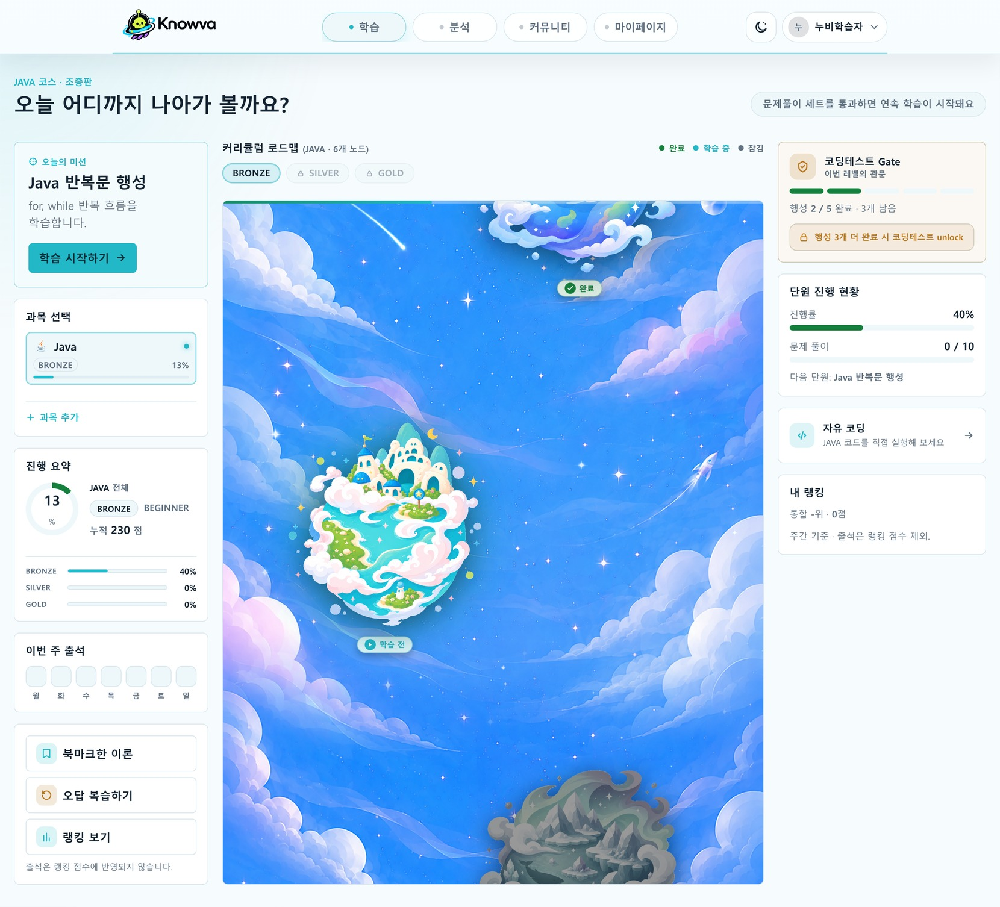
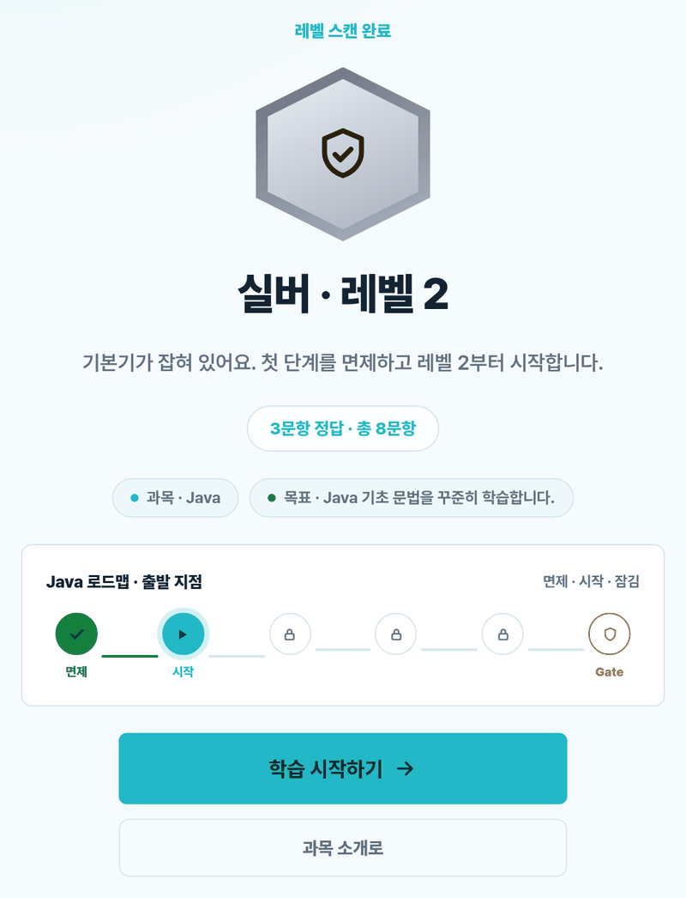
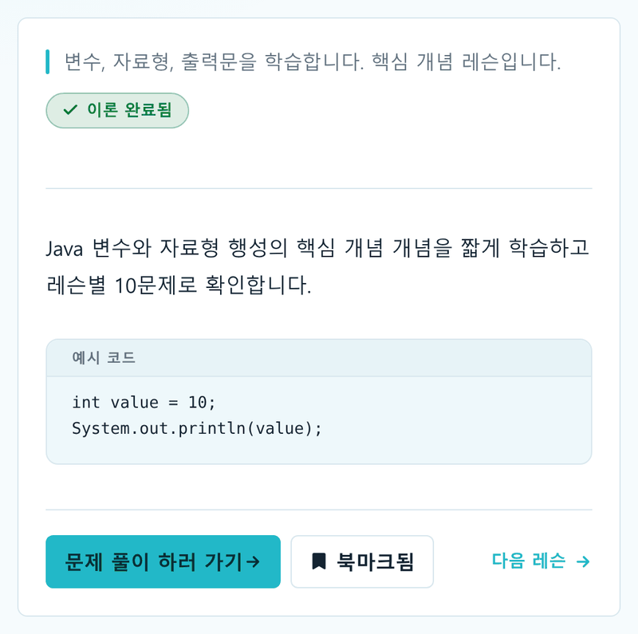
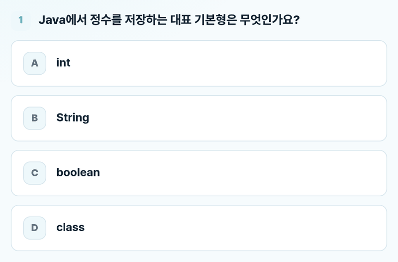
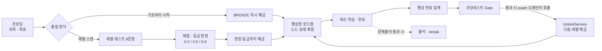
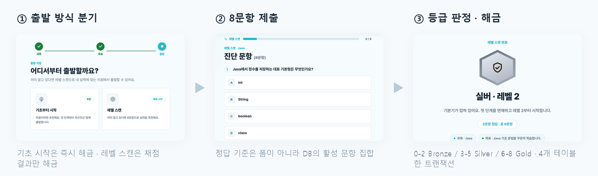

<br/>

<h3 align="center">행성 로드맵을 따라 진도가 열리는 코딩 학습 플랫폼 — <code>learning</code> 도메인</h3>

<p align="center">
  <a href="https://youtu.be/8a7laRKY914">시연 영상</a>
  ·
  <a href="https://app.notion.com/p/E-Knowva-37b04ef58e2a803287a3e65d4ec452b9?source=copy_link">기획 · 산출물</a>
</p>

<br/>

> 출발 방식 선택 한 번이 이후 모든 화면의 잠금을 결정. 레벨 테스트는 채점 → 등급 판정 → 해당 레벨까지 해금이 한 트랜잭션.<br/>
> **7명 팀 프로젝트 중 `learning` 도메인 담당.** 아래는 그 범위.

<br/>

## 미리보기



<br/>

|  |  |
|:--:|:--:|
| **레벨 판정 → 해금** · 3/8 정답 = 실버, 1단계 면제 | **잠긴 레벨** · 서버가 확정한 `locked` 를 그대로 렌더 |
|  |  |
| **이론 레슨** · 완료 처리 · 북마크 토글 | **진단 문항** · 사전 등록 8문항 (AI 미사용) |

<br/>

## 프로젝트 개요

**왜 만들었나** — 초보 학습자가 겪는 문제는 자료 부족이 아니라 **"지금 무엇을 공부할 차례인지"** 판단이 서지 않는 것.
과목 커리큘럼을 행성 단위 로드맵으로 펼치고 다음 한 칸만 열어, 순서 자체를 서비스가 제시하는 구조로 설계.

**왜 잠금을 서버에서 확정하나** — 화면과 서버가 각자 잠금을 판단하면 반드시 어긋남.
실제로 잠긴 행성이 클릭 가능한 모습으로 그려졌다가 레슨 진입 시 403이 발생하는 문제를 겪음(트러블슈팅 3).
이후 노드 상태를 컨트롤러에서 확정해 문자열로 넘기고, 템플릿은 받은 값을 그리기만 하는 구조로 정리.

| | |
| --- | --- |
| **기간 · 인원** | 2026.06 ~ 07 · 7인 팀 (에이콘아카데미 KDT 최종 프로젝트) |
| **담당** | `learning` 도메인 · 비주얼(로고 · 마스코트 누비 · 행성 심볼) |
| **담당 범위 규모** | Java 69개 파일 · MyBatis 매퍼 XML 15개 · 도메인 커밋 32건 중 23건 |
| **평가** | 외부 심사가 포함된 평가에서 팀 1위 (팀 성과) |
| **저장소** | 포트폴리오용 fork. 원본 [hyunkyumlee/Acorn-E-Learning](https://github.com/hyunkyumlee/Acorn-E-Learning) |

<br/>

## 주요 기능

| | 기능 | 무엇으로 어떻게 구현했나 |
| :--: | --- | --- |
| 🚀 | **온보딩 · 출발 방식** | `OnboardingController`에서 분기. "기초부터 시작"은 수강 신청과 동시에 최저 레벨 해금, "레벨 스캔"은 신청만 하고 해금 보류. 신청은 `(user_id, subject_id)` 기준 멱등이라 뒤로 가기·재클릭에도 신청 행이 늘지 않음 |
| 🪐 | **커리큘럼 로드맵** | 행성·레슨·게이트 노드의 `done / current / open / locked` 를 `LearningController`에서 확정해 문자열로 전달. 행성은 완료 개수 기준 순차 판정이라 **다음 한 칸만** `current` |
| 🎯 | **레벨 테스트** | 8문항 제출 한 번을 attempt · answers · 프로필 레벨 · 해금 이력 **4개 테이블에 한 트랜잭션**으로 반영. 등급은 정답 수 기준 0–2 Bronze / 3–5 Silver / 6–8 Gold (**AI 미사용** · 사전 등록 문항) |
| 📖 | **이론 레슨 · 북마크** | 레슨 상세와 완료 처리. 북마크는 `uk(user_id, lesson_id)` 토글 |
| 📊 | **진행률 집계** | 레슨 단위 집계를 유일 기준으로 SQL `COUNT` 산출 → 행성 완료 수 · 진행률 · 다음 학습 대상이 모두 같은 집계 하나에서 파생 |
| 🔥 | **출석 · streak** | 접속이 아니라 **문제풀이 세트를 통과한 날에만** `attendance_records` 기록. 하루 1회 멱등이고, 기준 시각은 `ZoneId.of("Asia/Seoul")` 고정이라 서버 타임존이 바뀌어도 "3일 연속"의 기준이 동일 |
| 🔓 | **UnlockService** | 팀원이 남긴 **16줄 stub을 66줄 서비스로 구현.** AI 코딩테스트를 통과하면 `exam` 도메인(`AiExamService`)이 이 서비스를 호출해 다음 레벨 해금 |

<br/>

### 핵심 1 — 레벨을 여는 주체를 경로마다 분리



해금 진입점은 세 갈래 — 수강 신청, 레벨 테스트 판정, AI 시험 통과.
이 중 **도메인 밖에서 들어오는 경로가 `exam`** 이고, `AiExamService`가 `UnlockService`를 호출하는 지점이 도메인 경계.
해금은 되돌리기 어려운 이력 데이터라 중복 호출이 들어온다는 전제로 멱등하게 작성.

핵심은 "레벨 스캔"을 고른 경우 **온보딩이 레벨을 열지 않는다**는 것.
스캔 경로에서 레벨을 여는 주체는 온보딩이 아니라 채점 결과이고, 문항이 등록되지 않은 과목은 스캔을 시작할 수 없어 기초 시작으로 자동 처리.

> 📄 [`OnboardingController.java#L92-L102`](https://github.com/lastsummer0830/Knowva/blob/aca25e48ced478fda4846486c911dc7403706074/ELearning/src/main/java/com/acorn/elearning/learning/controller/OnboardingController.java#L92-L102)

<br/>

### 핵심 2 — 레벨 테스트를 4개 테이블 한 트랜잭션으로



8문항 제출 한 번이 시도 이력·답안·프로필 레벨·해금 이력을 동시에 변경.
부분 성공으로 상태가 어긋날 위험을 막으려고 트랜잭션 경계를 제출 처리 전체에 설정.

- **채점 기준을 폼이 아니라 DB의 활성 문항 집합에서 조회.** 정답을 화면으로 내려보내지 않아 조작 불가.
- 레벨 테스트는 배치(placement) 성격이라 판정 등급까지의 하위 레벨을 모두 개방.
- 재응시로 등급이 낮게 나와도 `updateLevelIfHigher`라 이미 도달한 레벨은 하향되지 않음.

> 📄 [`LevelTestService.java#L117-L186`](https://github.com/lastsummer0830/Knowva/blob/aca25e48ced478fda4846486c911dc7403706074/ELearning/src/main/java/com/acorn/elearning/learning/service/LevelTestService.java#L117-L186) ·
> [`grade()#L216-L235`](https://github.com/lastsummer0830/Knowva/blob/aca25e48ced478fda4846486c911dc7403706074/ELearning/src/main/java/com/acorn/elearning/learning/service/LevelTestService.java#L216-L235)

<br/>

## 기술 스택

| 구분 | 사용 | 선택 이유 |
| --- | --- | --- |
| **언어 · 프레임워크** | Java 17 · Spring Boot 4.0.6 | 팀 공통 스택. 계층이 아니라 **도메인 단위로 패키지를 분리**해 7명이 같은 파일을 건드리지 않도록 분담 |
| **DB 접근** | MyBatis 4.0.1 | 팀 공통 스택. 담당 도메인은 노드 상태 판정에 조건 분기가 몰려 있어, SQL을 직접 쓰고 집계를 DB에서 끝내는 편이 유리 (`learning` 매퍼 XML 15개) |
| **DB** | MySQL 8 | 팀 공통 스택. 중복 완료 차단에 `ON DUPLICATE KEY UPDATE`를 원자 선점 수단으로 활용 |
| **뷰** | Thymeleaf | 노드 상태를 서버에서 확정해 문자열로 넘기는 구조라, 템플릿은 조건 계산 없이 렌더만 담당 |
| **테스트** | JUnit 5 · 매퍼 test double | 멱등 동작을 DB 없이 검증하려고 `LearningProgressMapper`를 직접 구현한 test double 사용 |

<br/>

## 실행 방법

**요구 사항** — JDK 17 · MySQL 8

```bash
git clone https://github.com/lastsummer0830/Knowva.git
cd Knowva/ELearning

# 스키마 + 시드. 3개를 순서대로. (각 파일이 CREATE DATABASE / USE 를 직접 수행)
mysql -u <user> -p < ../docs/sql/Knowva_DDL.sql
mysql -u <user> -p < ../docs/sql/Knowva_Java_Curriculum_Data.sql
mysql -u <user> -p < ../docs/sql/Knowva_demo_setup_data.sql

./gradlew bootRun
```

`application.properties`에 실값이 없어 **아래 10개는 없으면 기동 자체가 실패**한다(fail-fast).

```bash
DB_URL=jdbc:mysql://127.0.0.1:3306/elearning   DB_USERNAME=...   DB_PASSWORD=...
REMEMBER_ME_SECRET=<임의 문자열>               APP_BASE_URL=http://localhost:8080
AI_PROVIDER=openai  AI_ENABLED=false  AI_API_KEY=  AI_BASE_URL=https://api.openai.com/v1  AI_MODEL=gpt-4o-mini
```

- **AI·OAuth·결제·메일은 키 없이도 된다.** `AI_ENABLED=false` 로 두면 값만 채워져 있으면 되고, 나머지는 기본값이 있어 해당 기능만 비활성.
- 접속 `http://localhost:8080` → `/signup` 으로 가입하면 온보딩부터 시작. `learning` 화면은 `/learning` · `/learning/onboarding` · `/learning/level-test`.
- 시드에 데모 계정이 들어 있으나 **자격증명은 문서화하지 않는다**(시드 파일 정책).

> **재현 검증** — 백지 스키마에 위 SQL 3개 적재(46 테이블 · 커리큘럼 노드 72 · 레슨 600 · 진단 문항 8) 후
> `bootRun` 기동, `/learning` · `/learning/onboarding` · `/learning/level-test` · 레슨 상세 · 북마크 렌더까지 확인.
> 미검증 = OAuth 로그인 · 결제 · AI 채점 (외부 키 필요).

<br/>

## 구조

```text
learning/
├── controller/   # 온보딩 · 로드맵 · 레슨 · 레벨 테스트 진입점. 노드 상태를 여기서 확정
├── service/      # Unlock · LevelTest · Progress · Lesson · Attendance · Enrollment · Curriculum
├── mapper/       # MyBatis 인터페이스 (XML 15개는 resources/mappers/learning/)
└── dto/          # 화면에 넘길 확정 상태 · 집계 결과
```

계층이 아니라 **도메인으로 최상위 패키지를 나눈 구조** — 7명이 각자 `learning` · `exam` · `community` 처럼 자기 패키지 안에서만 작업하고, 도메인을 넘는 지점만 서비스 호출로 노출.
`learning`의 경우 `exam` 도메인이 `UnlockService`를 호출하는 곳이 그 경계.

<br/>

## 트러블슈팅

### 1. 레슨 하나만 끝내도 행성이 완료로 표시

**문제** — 행성 완료를 `curriculum_nodes`의 플래그로 판정한 결과, 그 행성의 레슨 하나만 완료해도 행성 전체가 완료로 표시.
진행률·다음 학습 대상·게이트 응시 자격이 전부 이 값을 참조하고 있어 **세 화면이 동시에 오작동.**

**시도한 방법**

| 방법 | 판단 |
| --- | --- |
| 완료 시점에 플래그를 정확히 갱신 | 갱신 지점이 여러 곳이라 하나만 누락돼도 재발 |
| 레슨 목록을 통째로 조회해 Java에서 계수 | 불필요한 본문까지 적재하고, 세는 규칙이 호출부마다 분산 |
| **레슨 단위 집계를 유일 기준으로, 개수는 SQL `COUNT`** | **채택** |

**선택 이유** — 문제의 뿌리는 "완료의 정의가 두 군데(플래그 / 실제 레슨)에 존재"한다는 것.
플래그를 정확히 갱신하는 방식은 어긋남을 늦출 뿐이라, 완료 여부를 레슨 집계에서 직접 계산하도록 전환.

**결과** — 활성·필수 레슨이 1개 이상이고 전부 이론·문제풀이를 통과해야 행성 완료.
완료 행성 수는 앞에서부터 **연속 완료된 개수만** 세고 첫 미완료 행성에서 중단(순차 학습 규칙).
진행률·완료 수·다음 학습 대상이 모두 같은 집계 하나에서 파생.

> 📄 [`ProgressService.java#L153-L189`](https://github.com/lastsummer0830/Knowva/blob/aca25e48ced478fda4846486c911dc7403706074/ELearning/src/main/java/com/acorn/elearning/learning/service/ProgressService.java#L153-L189)

<br/>

### 2. 완료 버튼을 두 번 누르면 두 번 기록

**문제** — 레슨 완료가 "조회해서 없으면 insert" 구조.
새로고침·더블 클릭·동시 요청이 조회와 insert 사이를 파고들면 완료가 중복 기록.

**시도한 방법**

| 방법 | 판단 |
| --- | --- |
| 버튼 비활성화 등 화면에서 차단 | 요청을 직접 보내면 그대로 통과 |
| 서비스에 `synchronized` | 서버가 여러 대가 되는 순간 무의미 |
| **매퍼의 중복 키 처리(`ON DUPLICATE KEY UPDATE`)로 원자 선점** | **채택** |

**선택 이유** — 조회와 insert 사이의 빈틈은 애플리케이션 조건문으로 차단 불가.
"이미 완료했는가"의 판정을 SQL 한 문장 안으로 이동.

**결과** — 최초 요청만 변경 행 1 이상을 수신하고, 이미 완료된 요청은 **0을 받아 409**로 종료.
노드 진행 행도 같은 방식의 원자 upsert로 전환해 중복 insert 제거.

> 📄 [`LessonService.java#L88-L101`](https://github.com/lastsummer0830/Knowva/blob/aca25e48ced478fda4846486c911dc7403706074/ELearning/src/main/java/com/acorn/elearning/learning/service/LessonService.java#L88-L101) ·
> [`claimTheoryCompletion` SQL](https://github.com/lastsummer0830/Knowva/blob/aca25e48ced478fda4846486c911dc7403706074/ELearning/src/main/resources/mappers/learning/UserLessonProgressMapper.xml#L46-L55)

<br/>

### 3. 잠긴 행성이 눌리는데 진입하면 403

**문제** — 로드맵 화면은 진행률을 기준으로, 레슨 진입 가드는 `user_level_unlocks`를 기준으로 잠금을 판단.
기준이 둘로 갈린 탓에 **잠긴 레벨의 행성이 클릭 가능한 모습으로 렌더**된 뒤 레슨에서 403 발생.

**시도한 방법**

| 방법 | 판단 |
| --- | --- |
| 템플릿 조건식에 해금 여부를 추가 | 판정이 화면·서버 두 곳에 남아 다시 갈릴 여지 |
| **컨트롤러에서 상태를 확정해 문자열로 전달** | **채택** |

**선택 이유** — 화면과 서버가 각자 판단하는 한 어긋남은 반복.
노드 상태를 컨트롤러에서 확정해 문자열로 넘기고, 템플릿은 받은 값을 그리는 역할로 축소.

**결과** — 해금되지 않은 레벨은 다른 판정보다 먼저 전 노드를 `locked`로 확정.
잠긴 레벨은 행성·게이트가 모두 잠김으로 그려지고 "이 레벨이 열리면 응시할 수 있어요"를 안내.
**화면에서 눌리는 것은 서버에서도 통과**하는 상태로 일치.

> 📄 [`LearningController.java#L201-L235`](https://github.com/lastsummer0830/Knowva/blob/aca25e48ced478fda4846486c911dc7403706074/ELearning/src/main/java/com/acorn/elearning/learning/controller/LearningController.java#L201-L235)

<br/>

## 회고

- **잘한 것** — "완료란 무엇인가", "레벨을 여는 주체는 누구인가"를 코드보다 먼저 정한 것. 판정 기준을 하나로 정리하니 어긋나 있던 화면 세 개가 동시에 정상화.
- **아쉬운 것** — 동시성 문제를 설계가 아니라 버그로 만난 뒤 수정. 착수 시점에 "이 버튼을 두 번 누르면?"을 넣었어야 하는 사안.
- **테스트** — 멱등 동작은 매퍼 test double로 5개 케이스 검증(`ProgressServiceMarkPracticePassedTest`). 반면 로드맵 노드 상태 판정과 레벨 테스트 채점은 여전히 화면 확인에 의존. 상태 판정 쪽 회귀 테스트가 다음 과제.
- **남아 있는 문제** — 진행률 계산이 행성마다 `COUNT` 두 번을 실행(`computeRoadmapProgress` 루프). 행성이 6개인 현재 규모에서는 무리가 없으나 전형적인 N+1이라, 과목당 한 번의 집계 쿼리로 통합하는 것이 과제.
- **한계** — 레벨 테스트 문항은 사전 등록 pool 기반. 과목별 문항 수가 늘어나면 8문항 선택 전략을 재검토해야 하는 구조.
